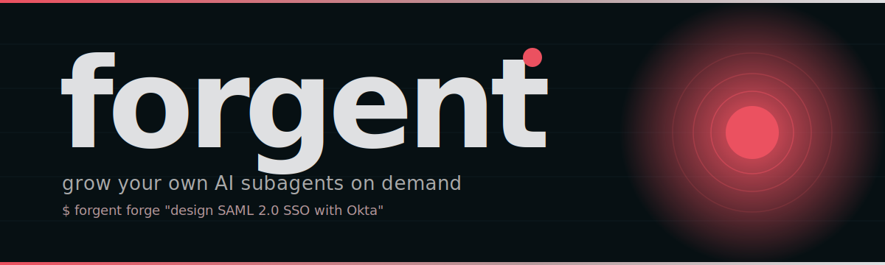

<p align="center">
  
</p>

# forgent

> **Give Claude superpowers.** A meta-orchestrator that routes any task to the best curated agent across Claude Code subagents, Python multi-agent frameworks (LangGraph / CrewAI / OpenAI Agents SDK / mcp-agent), and MCP servers — and **forges brand-new specialist subagents on demand** when no curated agent fits.
>
> Ships as a single MCP server. Drop it into Claude Code, Claude Desktop, Cursor, Zed, or any MCP client and every Claude session gets the orchestrator's tools.

<p align="center">
  <a href="docs/brand.md"></a>
  <a href="docs/INTEGRATION.md"></a>
  
  
</p>

## Why this exists

The agent ecosystem is fragmented into three silos that don't talk to each other:

| Silo | Top repos | Strengths | Weaknesses |
|---|---|---|---|
| Claude Code subagents | wshobson/agents (32.7k★), VoltAgent/awesome-claude-code-subagents, 0xfurai/claude-code-subagents | huge variety of specialists, markdown-portable | only run inside Claude Code |
| Python frameworks | LangGraph, CrewAI, AutoGen, lastmile-ai/mcp-agent | production-ready workflows, eval tooling | need code, framework lock-in |
| MCP servers | modelcontextprotocol/servers, github/github-mcp-server, lastmile-ai/mcp-agent | standardized tools and data access | one-server-per-tool, no orchestration |

A user with a task currently has to pick a *silo* before they can pick a *solution*. This project erases that line. You give it a task in plain English. It picks the best agent from any ecosystem, runs it, remembers what happened, and gets smarter next time.

## What's inside

- **63 hand-curated agents** across 11 categories (core dev, language specialists, infrastructure, quality/security, data/AI, dev experience, specialized domains, business/product, meta-orchestration, research) — picked from the highest-quality public repos.
- **AgentForge** — synthesizes brand-new specialist subagents on demand using Claude. The orchestrator literally grows new capabilities over time. Forged agents are persisted and reused forever.
- **LLM-based router** with structured tool-use that maps any task → best primary agent + supporting agents + execution mode (single / sequential / parallel / evaluator-optimizer). Falls back to keyword scoring when no API key is available.
- **SQLite + FTS5 memory system** that stores every task, routing decision, and agent output, and recalls relevant past context on every new task. Zero external dependencies.
- **Three ecosystem adapters** with a common async interface — Claude Code (Anthropic API), Python frameworks (workflow patterns from `lastmile-ai/mcp-agent`), and MCP servers (stdio + optional `mcp` SDK).
- **Stdio MCP server** — exposes 8 tools (`run_task`, `forge_agent`, `list_agents`, `search_agents`, `show_agent`, `recall_memory`, `memory_stats`, `route_only`) so every Claude environment can call the orchestrator.
- **Typer-based CLI** for running tasks, browsing the registry, forging agents, and inspecting memory.
- **Shippable wheel** + one-shot install script that handles pipx, the macOS sandbox quirk, and prints the exact registration commands for Claude Code and Claude Desktop.

## Architecture

```
                ┌───────────────────────────┐
                │   forgent run "..."  │
                └─────────────┬─────────────┘
                              │
                ┌─────────────▼─────────────┐
                │   MemoryStore.context_for │  ← recall past sessions
                └─────────────┬─────────────┘
                              │
                ┌─────────────▼─────────────┐
                │   Router (LLM + tool-use) │  ← classify, pick agents
                └─────────────┬─────────────┘
                              │
       ┌──────────────────────┼──────────────────────┐
       ▼                      ▼                      ▼
 ┌───────────┐         ┌────────────┐         ┌────────────┐
 │ Claude    │         │ Python     │         │ MCP server │
 │ Code      │         │ framework  │         │ adapter    │
 │ adapter   │         │ adapter    │         │ (stdio)    │
 └─────┬─────┘         └──────┬─────┘         └──────┬─────┘
       │                      │                      │
       └──────────────────────┼──────────────────────┘
                              │
                ┌─────────────▼─────────────┐
                │   MemoryStore.remember    │  ← persist for next time
                └───────────────────────────┘
```

## Install

Requires Python 3.10+.

### Quickest — pipx + install script (recommended)

```bash
git clone <this repo>
cd agent-orchestration
python3 -m build --wheel              # produces dist/forgent-*.whl
./scripts/install.sh                  # pipx-installs + prints MCP registration commands
```

After this, both `orchestrator` and `forgent-mcp` are on your `$PATH` from any directory.

### Manual / development

```bash
make install                          # creates .venv, installs editable, fixes macOS .pth quirk
make vendor                           # copies source agent files into the registry
make test                             # runs the smoke suite

cp .env.example .env                  # add ANTHROPIC_API_KEY
.venv/bin/forgent stats
```

### Register with every Claude environment

See **[docs/INTEGRATION.md](docs/INTEGRATION.md)** for the full guide. Short version:

```bash
# Claude Code (any project on your machine)
claude mcp add forgent \
  --env ANTHROPIC_API_KEY=$ANTHROPIC_API_KEY \
  --env FORGENT_DB=./forgent.db \
  -- $(which forgent-mcp)
```

For Claude Desktop, edit `~/Library/Application Support/Claude/claude_desktop_config.json` and add the orchestrator under `mcpServers` (snippet in the integration guide).

## Usage

### Run a task

```bash
forgent run "design a Stripe webhook handler with idempotency and PCI-safe logging"
```

The CLI will:
1. Recall any relevant prior context from memory
2. Show the routing decision (which agent, why, confidence)
3. Print the agent's output
4. Store everything for next time

### Browse the registry

```bash
forgent agents list                          # all 50+ curated agents
forgent agents list --category data-ai       # filter by category
forgent agents list --ecosystem mcp          # filter by ecosystem
forgent agents search "kubernetes security"  # keyword search
forgent agents show backend-developer        # full system prompt
```

### Inspect memory

```bash
forgent stats                          # overview
forgent memory stats                   # what's stored
forgent memory recall "stripe"         # what would the orchestrator remember
forgent memory recall "auth" --type routing
forgent memory forget                  # wipe (with confirmation)
```

### Forge new subagents on demand

This is the killer feature. When you hit a task that no curated agent handles well, ask the orchestrator to *grow* a new specialist for it:

```bash
forgent forge "write Solidity smart contracts with formal verification (Certora, Halmos)"
```

Or in any Claude environment with the MCP server registered:

> "Use forge_agent to create a specialist for SAML 2.0 SSO integrations with Okta and Azure AD."

Claude calls Claude. The new agent gets a real system prompt (400+ words, structured with checklists), a name, capabilities tags, and is persisted to `dynamic.yaml` + `registry/agents/claude_code/<name>.md`. From now on, every `list_agents`, `search_agents`, and `route_only` call sees it. The orchestrator is *literally getting smarter*.

You can also enable auto-forging on `run`:

```bash
forgent run --auto-forge "design RFC-compliant LDAP query optimization for AD"
```

When the router's confidence is below 0.4, it forges a fresh specialist for the task class and uses it.

### Vendor agent files for offline use

```bash
forgent vendor          # copies source .md files into the registry
forgent vendor --force  # overwrite existing vendored files
```

After vendoring, the `sources/` directory can be deleted — the registry is self-contained.

## Memory system

The memory store (`src/forgent/memory/store.py`) is a SQLite database with an FTS5 virtual table for full-text recall. Every interaction lands in there:

| Memory type | What it is |
|---|---|
| `task` | the original user request |
| `routing` | the router's decision and reasoning |
| `agent_output` | what an agent produced |
| `decision` | a checkpoint or branch decision |
| `agent_doc` | curated agent definitions (for retrieval-aware routing) |
| `note` | free-form notes from the system or user |
| `artifact` | file paths or blobs produced by agents |

The orchestrator automatically calls `MemoryStore.context_for(task)` before every run, which returns a ranked context block (relevant outputs + relevant past routing decisions + institutional knowledge) ready to inject into the next agent's system prompt. This is why the system gets smarter over time — past routing decisions become few-shot examples for the router.

## Adding agents

1. Find a strong candidate in `sources/` or any GitHub repo.
2. Add an entry to `src/forgent/registry/catalog.yaml` with `name`, `ecosystem`, `category`, `capabilities`, `source_repo`, `source_path`, `description`.
3. Run `forgent vendor` to copy the file into `src/forgent/registry/agents/`.
4. Smoke test: `forgent run "task that should match this agent"`.

## Adding ecosystems

Implement `forgent.adapters.base.Adapter` and register it in `Orchestrator.__init__`. The adapter interface is intentionally minimal:

```python
class Adapter(ABC):
    ecosystem: Ecosystem

    async def run(self, agent: AgentSpec, task: str, context: str = "") -> AdapterResult: ...
```

## Source repos used for curation

| Repo | Stars | What was taken |
|---|---|---|
| [VoltAgent/awesome-claude-code-subagents](https://github.com/VoltAgent/awesome-claude-code-subagents) | high | ~45 agents across 10 categories — primary source |
| [wshobson/agents](https://github.com/wshobson/agents) | 32.7k★ | plugin-style agents and orchestration patterns |
| [0xfurai/claude-code-subagents](https://github.com/0xfurai/claude-code-subagents) | high | language/framework experts (138 single-file agents) |
| [lastmile-ai/mcp-agent](https://github.com/lastmile-ai/mcp-agent) | growing | workflow patterns (router, orchestrator, parallel, evaluator-optimizer, swarm, deep-orchestrator) |
| [modelcontextprotocol/servers](https://github.com/modelcontextprotocol/servers) | official | filesystem, fetch, and other reference MCP servers |
| [github/github-mcp-server](https://github.com/github/github-mcp-server) | official | GitHub MCP server |

## Support & contributor rewards

This project is MIT-licensed and free to use forever. If you find it valuable, you can support development in two ways:

- **[GitHub Sponsors](https://github.com/sponsors/alialaayedi)** — recurring or one-time
- **[Open Collective](https://opencollective.com/subagent-forge)** — fully transparent fund where every dollar in and out is public

### Contributors get a share

Unlike most open-source projects, **a portion of every donation goes back to the people who make this better**. The model:

| What you do | What you get |
|---|---|
| Land a merged PR (any size, even docs) | Listed as a contributor and added to the Open Collective as an approved expense recipient |
| Land 3+ merged PRs in a quarter | Eligible for a quarterly donation split — currently **40% of all donations that quarter** are pooled and split among active contributors weighted by PRs merged |
| Maintainer-level contributions (architecture, adapters, large features) | Eligible for a larger discretionary share |
| Become a co-maintainer | Co-control the donation pool and distribution rules |

Distribution is handled transparently through Open Collective so every payout is public. The remaining 60% covers infrastructure (CI, domain, hosted demo) and the lead maintainer's time.

**This is intentional**: I want this project to grow because contributors are *materially* rewarded for shipping, not just thanked in a CHANGELOG. If you've ever wanted to get paid (even a little) for your open-source work, this is the experiment.

### How to start contributing

1. Read [`CONTRIBUTING.md`](CONTRIBUTING.md) — quickstart is `make install && make test`
2. Pick an issue tagged `good first issue` or `help wanted`
3. Open a PR. Even a typo fix counts toward the 3-PR threshold.
4. After merge, you'll be invited to the Open Collective as an approved recipient.

Ideas for high-value contributions:
- New ecosystem adapters (AutoGen, Semantic Kernel, Bedrock Agents, Vellum)
- Vector embedding column for the memory store (currently FTS5-only)
- A web dashboard for browsing sessions and forged agents
- Turning the catalog into a YAML registry that pulls fresh agents from upstream weekly
- A `forge_from_examples` command that learns a new agent from a few input/output pairs

## License

MIT. Curated agent definitions retain their original licenses from the source repos.
